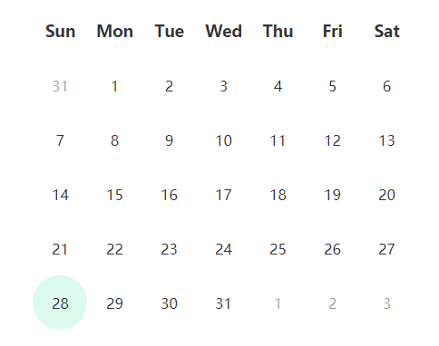

# 用原生的javascript实现简单日历

### HTML
其中html日历结构我用table和li都试了，table布局浏览器兼容性比较好，li我用flex布局在不同大小设备上自适应布局很好。具体看个人要求，我这里用的是ul,li结构。

### 主要javascript技术

要画出一个现实中的所有日期，可能有上一个月的，也可能有下一个月的，如下图所示。

而我们能获取到的只是今天的日期（包括年，月，日，周几）。如果我们能获取到每一个日历页面的第一个的日期那就好说了，顺着这个思路。我们可以根据今天的日期获取到年（year），月（month）,日（date）,那么可以用 `new Date(year,month,1)` 获取到的就是现在所在的这个月的第一天。假如当月第一天为 `firstDayOfMonth` ,然后就可以获取到当月第一天的周几数： `var nthDay = firstDayOfMonth.getDay()` ;我们知道日历中的第一天是周日，然后用 `var firstDay = new Date(year,month,-nthDay)` 就可以获取到日历的第一天。注意这里 `-nthDay` ,**Date这个对象会返回离参数最近的有效日期**， 具体可以看MDN上这里[参数](https://developer.mozilla.org/zh-CN/docs/Web/JavaScript/Reference/Global_Objects/Date)的介绍。然后我们就可以循环用js画出日历中每一天的日期了。具体看代码实现。
